# SchneeGlass UI Gallery

This gallery shows the canonical visual regression references for the current SchneeGlass UI.

The images are **not copied into a separate documentation asset directory**. Every image below points directly to the committed snapshot baseline under `Packages/SchneeGlassKit/Tests/SchneeGlassVisualSnapshotTests/__Snapshots__`, so the visual regression reference remains the single image source of truth.

## Visual contract

- Canonical renderer: GitHub-hosted macOS 26 / Xcode 26.6
- Contract manifest: [`Scripts/visual-snapshot-contract.txt`](../Scripts/visual-snapshot-contract.txt)
- Verification: [`Scripts/verify-visual-snapshots.sh`](../Scripts/verify-visual-snapshots.sh)
- Explicit local refresh: `bash Scripts/update-visual-snapshots.sh`
- CI verifies snapshots in record-never mode; CI never accepts or records a new baseline automatically.

These are deterministic synthetic fixtures for review and regression detection, not screenshots of user data. An intentional visual change should update the affected snapshot references in a dedicated reviewable change; this gallery then updates automatically because it references those same files.

## Workspace

### Populated workspace

| Light | Dark |
| --- | --- |
| 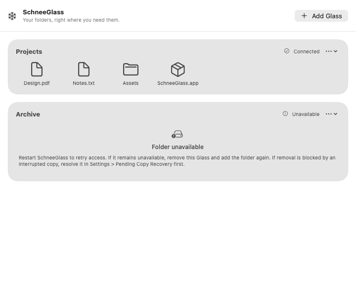 | 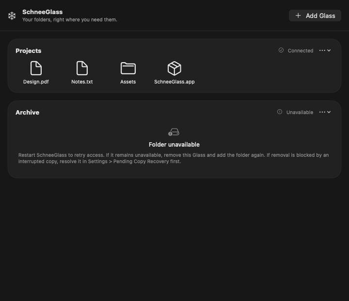 |

### Empty and message states

| Empty | Empty with message |
| --- | --- |
| 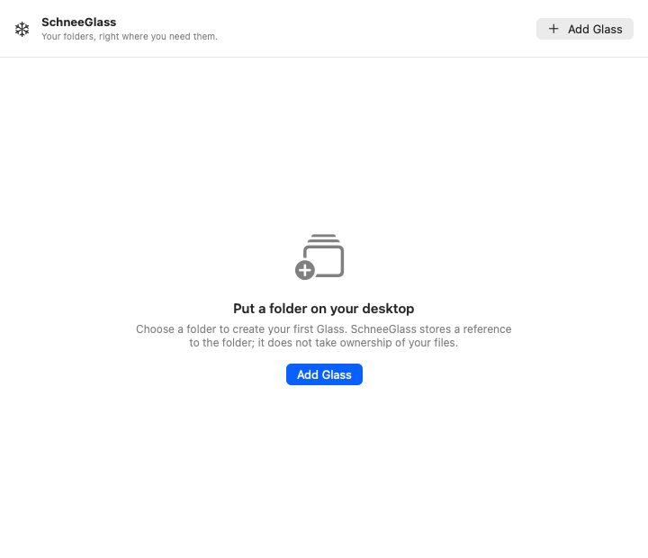 | 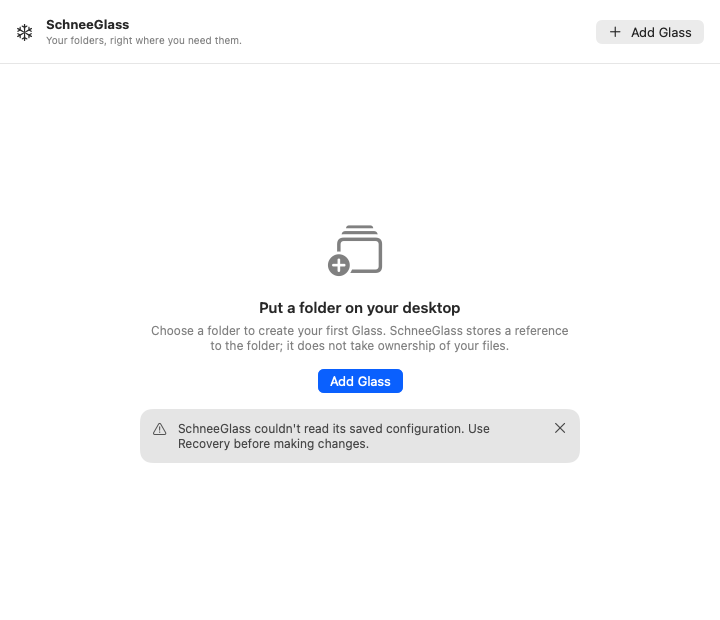 |

### Populated workspace with message

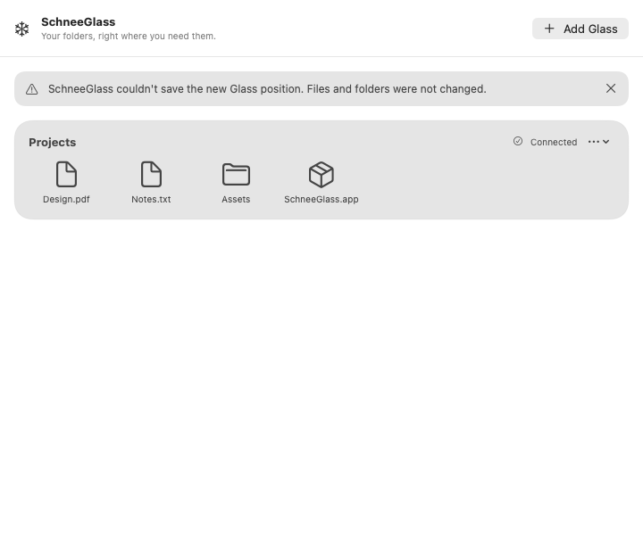

## Desktop Glass

### Ready and empty

| Ready / Light | Ready / Dark |
| --- | --- |
| 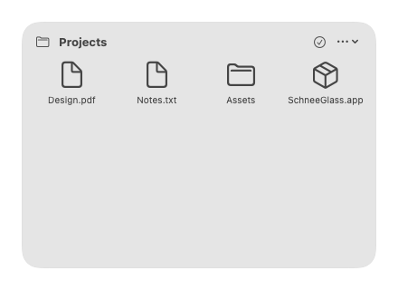 | 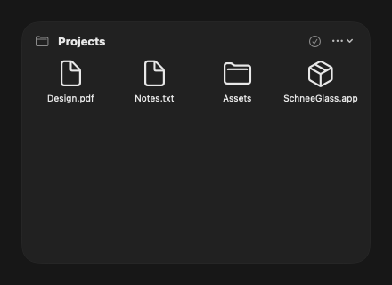 |

| Empty / Light | Empty / Dark |
| --- | --- |
| 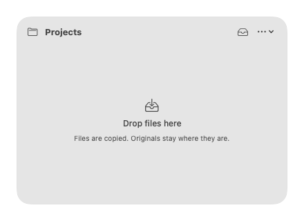 | 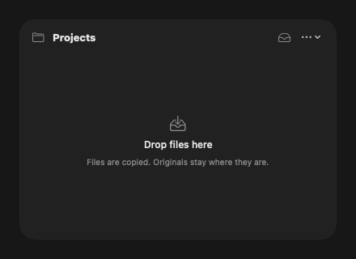 |

### Availability and failure

| Unavailable | Failed |
| --- | --- |
|  | 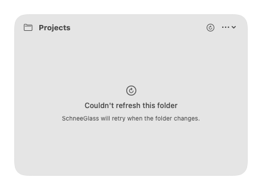 |

### Drag and drop validation

| Accepted drop | Rejected drop |
| --- | --- |
| 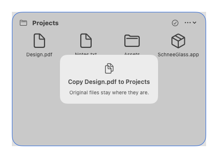 | 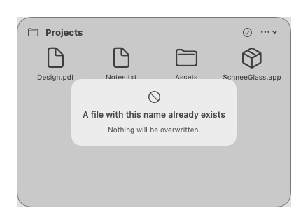 |

## Design System components

### State message

| Detail / Light | No detail / Dark |
| --- | --- |
| 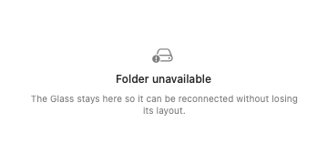 | 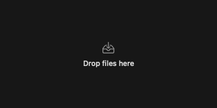 |

### File tile

| Regular file / Light | Directory / Light |
| --- | --- |
| 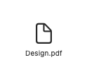 | 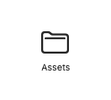 |

| Package / Dark | Long filename / Light |
| --- | --- |
| 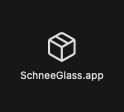 | 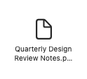 |

## Coverage boundary

This gallery mirrors the canonical visual contract rather than attempting to document every possible runtime combination. Animated indeterminate states such as loading/copying are intentionally not treated as image baselines while they remain nondeterministic. Behavioral, safety, accessibility, and recovery semantics continue to be covered by the normal test suites and manual QA documentation.

See [`TESTING.md`](../TESTING.md) for the complete verification policy and [`DESIGN_SYSTEM.md`](DESIGN_SYSTEM.md) for the visual architecture and component rules.
